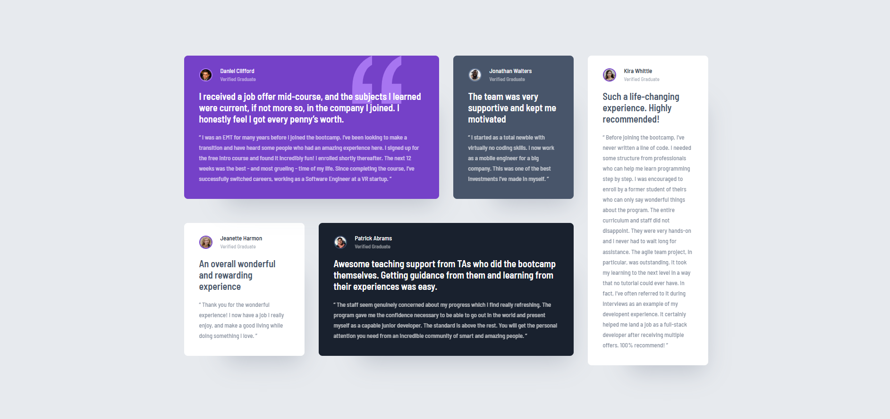

# Frontend Mentor - Testimonials grid section solution

This is a solution to the [Testimonials grid section challenge on Frontend Mentor](https://www.frontendmentor.io/challenges/testimonials-grid-section-Nnw6J7Un7).

## Overview

### The challenge

Users should be able to:

- View the optimal layout for the site depending on their device's screen size

### Screenshot

### Links

- Solution URL: [Solution on Github](https://github.com/rahmani-code/fm-testimonial-grid/)
- Live Site URL: [https://fm-challenge-testimonial-grid1.netlify.app/](https://fm-challenge-testimonial-grid1.netlify.app/)

## My process

### Built with

- HTML
- CSS
- CSS Grid
- Mobile-first workflow
